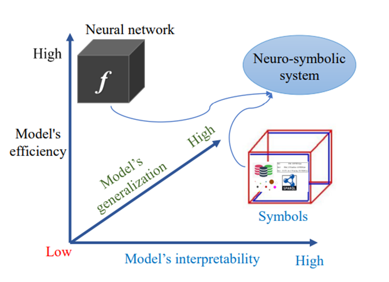

研究hybrid learning 及其它的记录
==========================
tags: Neural-Symbolic learning, machine learning, LLM 

我们所有的知识都开始于感性，然后进入到知性，最后以理性告终。没有比理性更高的东西了。——康德    

内容包括 学习笔记， 一些综述文章， 还有值得再看的presentation

# 关于hybrid learning
    1. What
	Hybrid learning, also known as neuro-symbolic AI, is an advanced version of artificial intelligence that improves how a neural network arrives at a decision by adding classical rules-based (symbolic) AI to the process. 
	This hybrid approach requires less training data and makes it possible for humans to track how AI programming made decision
	Hybrid learning is a better model for leveraging machine learning and human Expertise
	
	2. Why hybrid learning
	For achieving high accuracy, deep learning requires a large amount of data that is sometimes difficult, expensive, or impractical to obtain. Integrating human knowledge into machine learning can significantly reduce data requirement, increase reliability and robustness of machine learning, and build explainable machine learning systems.
	
	What Is Neuro-Symbolic AI And Why Are Researchers Gushing Over It (analyticsindiamag.com

The advantages of hybrid learning in model efficiency, generalization and interpretability (link)

